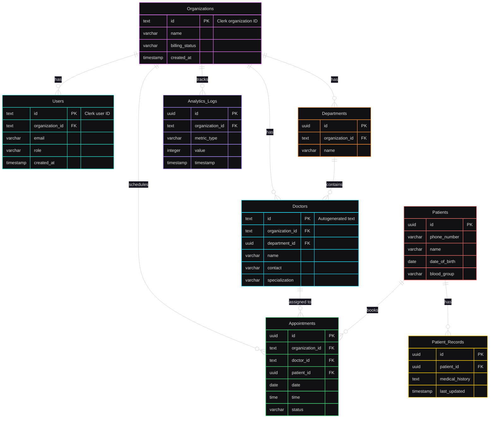

# HealthDrive Database Data Flow Diagram

This Mermaid diagram illustrates the flow of data across the HealthDrive database tables,
highlighting relationships and interactions between entities. It reflects the updated schema with
`text` types for `Organizations.id`, `Users.id`, `Doctors.id`, and related foreign keys
(`organization_id`, `doctor_id`).

### Diagram Explanation

- **Organizations** is the central entity, linking to `Users`, `Departments`, `Doctors`,
  `Appointments`, and `Analytics_Logs` via `organization_id` (text).
- `Users` are tied to `Organizations` through `organization_id` (text), representing facility staff,
  with `id` as text for Clerk user IDs.
- `Departments` belong to `Organizations` and group `Doctors` via `department_id` (uuid).
- `Doctors` are associated with `Organizations` (text `organization_id`) and optionally
  `Departments`, with `id` as autogenerated text, and are assigned to `Appointments`.
- `Patients` are linked to `Appointments` via `patient_id` (uuid) and have `Patient_Records` for
  medical history.
- `Appointments` connect `Organizations` (text `organization_id`), `Doctors` (text `doctor_id`), and
  `Patients` (uuid `patient_id`), capturing scheduling details.
- `Analytics_Logs` track metrics for `Organizations` (text `organization_id`), supporting real-time
  analytics.
- Arrows (`||--o{`) indicate one-to-many relationships, with foreign keys ensuring data integrity.

This diagram provides a clear view of how data flows through the HealthDrive database, supporting
features like appointment management, patient record access, and analytics, with updated text-based
IDs for Clerk integration.
